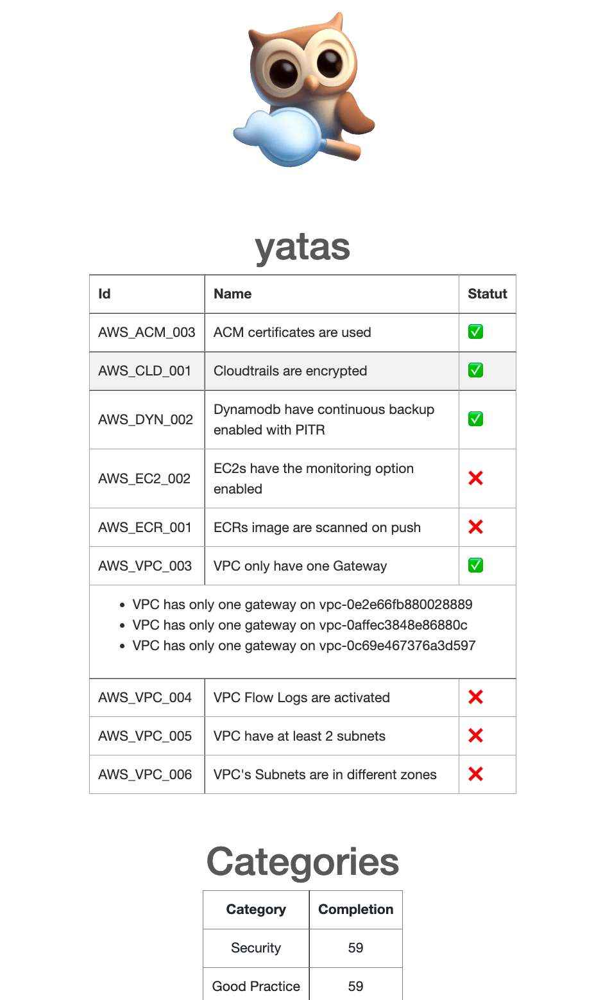

<p align="center">

<p align="center">

# YATAS HTML export

I see in Stan the roadmap, we want a plugin to export to html page.
So i try to implement this plugin to learn go.
## Usage
Use ```make install```

Generates a report in the current directory in report.html
in .yatas.yml file add:
```
  - name: "html"
    enabled: true
    type: "report"
    source: "github.com/StanGirard/yatas-html"
    version: "local"
    description: "Genereates a html report in report.html"
```

Run ```yatas --detail```

## Example
<p align="center">

<p align="center">

## Plugins implementation - TODELETE

Simply use this repository as a template and implement your own plugin.

Don't forget to change the name of the plugin in the `Makefile` and the `go.mod` file.

Add you code in `main.go` and in the function `RunPlugin` 